# 🍜 Case Study 1: Danny's Diner 

This repository contains my solutions to the **[Danny's Diner Case Study](https://8weeksqlchallenge.com/case-study-1/)**, which is part of the **#8WeekSQLChallenge** by Danny Ma. 

The project uses PostgreSQL syntax to analyze customer data, uncovering insights into customer behavior, spending habits, and the effectiveness of their loyalty program.

---

## 📋 Table of Contents
* [Business Case](#business-case)
* [Entity Relationship Diagram](#entity-relationship-diagram)
* [Database Schema](#database-schema)
* [Solutions & Insights](#solutions-and-insights)
* [Key Skills Demonstrated](#key-skills-demonstrated)

---

## Business Case
Danny wants to use data to answer a few simple questions about his customers, especially about their visiting patterns, how much money they’ve spent, and which menu items are their favorite. Having this deeper connection with his customers will help him deliver a better and more personalized experience for his loyal customers.

---

## Entity Relationship Diagram

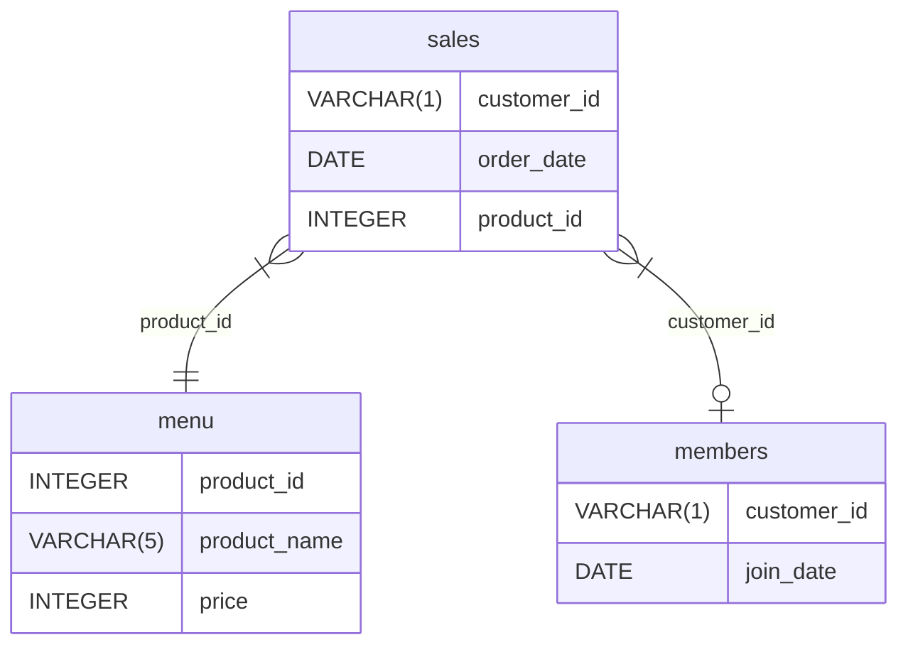


## Database Schema
The dataset consists of 3 key tables under the dannys_dinner schema:

sales: Captures all customer food orders with customer_id, order_date, and product_id.

menu: Maps the product_id to the actual product_name and price.

members: Tracks the exact date a customer (customer_id) signed up for the loyalty program.

## Solutions and Insights

### Q1: What is the total amount each customer spent at the restaurant?
``` SQL
SET search_path = dannys_dinner;

WITH diner AS (
    SELECT s.customer_id, n.product_name, s.order_date, s.product_id, n.price
    FROM dannys_dinner.sales s
    JOIN dannys_dinner.menu n
    ON n.product_id = s.product_id
) 
SELECT customer_id, SUM(price) AS total_spent 
FROM diner
GROUP BY customer_id
ORDER BY total_spent;
```
Query results Question 1:

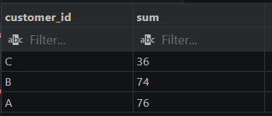

### Q2: How many days has each customer visited the restaurant?

```SQL
WITH diner AS (
    SELECT s.customer_id, n.product_name, s.order_date, s.product_id, n.price
    FROM dannys_dinner.sales s
    JOIN dannys_dinner.menu n
    ON n.product_id = s.product_id
)
SELECT customer_id, COUNT(DISTINCT(order_date)) AS count 
FROM diner
GROUP BY customer_id;
```

Query results Question 2:

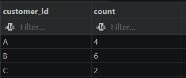

### Q3: What was the first item from the menu purchased by each customer?

```SQL
WITH diner AS (
    SELECT s.customer_id, n.product_name, s.order_date, s.product_id, n.price
    FROM dannys_dinner.sales s
    JOIN dannys_dinner.menu n
    ON n.product_id = s.product_id
) 
SELECT * FROM (
    SELECT customer_id, product_name, order_date,
    ROW_NUMBER() OVER(PARTITION BY customer_id ORDER BY order_date) AS ranks
    FROM diner
) sub
WHERE ranks = 1;
```
Query results Question 3:

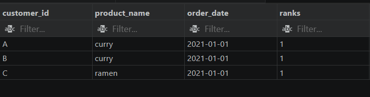

### Q4: What is the most purchased item on the menu and how many times was it purchased by all customers?

```SQL
WITH diner AS (
    SELECT s.customer_id, n.product_name, s.order_date, s.product_id, n.price
    FROM dannys_dinner.sales s
    JOIN dannys_dinner.menu n
    ON n.product_id = s.product_id
) 
SELECT product_name AS most_purchased,
COUNT(product_name) AS times_purchased 
FROM diner
GROUP BY product_name
ORDER BY times_purchased DESC
LIMIT 1;
```
Query results Question 4:

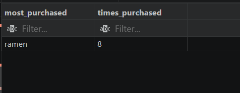

### Q5: Which item was the most popular for each customer?
### Option A: When ties have been eliminated (Using ROW_NUMBER())


```SQL
WITH filterdata AS (
    SELECT s.customer_id, n.product_name, s.order_date, s.product_id, n.price
    FROM dannys_dinner.sales s
    JOIN dannys_dinner.menu n
    ON n.product_id = s.product_id
),
ranked_item AS (
    SELECT customer_id AS customers, product_name, COUNT(product_name) AS order_count,
    ROW_NUMBER() OVER(PARTITION BY customer_id ORDER BY COUNT(product_name) DESC) AS ranked
    FROM filterdata
    GROUP BY customer_id, product_name
)
SELECT customers, product_name, order_count
FROM ranked_item
WHERE ranked = 1;
```

Query results (Ties Eliminated) Question 5:

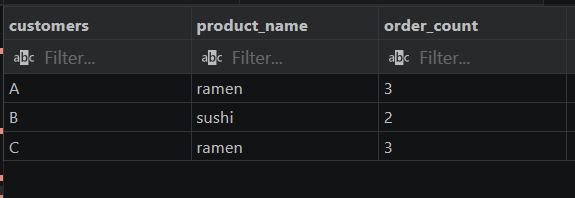

### Option B: When ties have NOT been eliminated (Using RANK())


```SQL
WITH diner AS (
    SELECT s.customer_id, n.product_name, s.order_date, s.product_id, n.price
    FROM dannys_dinner.sales s
    JOIN dannys_dinner.menu n
    ON n.product_id = s.product_id
),
ranked_item AS (
    SELECT customer_id AS customers, product_name, COUNT(product_name) AS order_count,
    RANK() OVER(PARTITION BY customer_id ORDER BY COUNT(product_name) DESC) AS ranked
    FROM diner
    GROUP BY customer_id, product_name
)
SELECT customers, product_name, order_count
FROM ranked_item
WHERE ranked = 1;

```
Query Result (Ties Retained) Question 5:

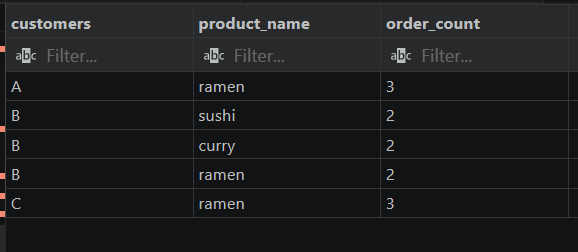

### Q6: Which item was purchased first by the customer after they became a member?

```SQL
WITH orders_after_membership AS (
    SELECT s.customer_id, m.join_date, n.product_name, s.order_date, s.product_id, n.price
    FROM dannys_dinner.sales s
    LEFT JOIN dannys_dinner.members m ON m.customer_id = s.customer_id
    JOIN dannys_dinner.menu n ON n.product_id = s.product_id
),
order_after_membership_ranking AS (
    SELECT customer_id, product_name, join_date, order_date, price,
    ROW_NUMBER() OVER(PARTITION BY customer_id ORDER BY order_date::DATE) AS ranked
    FROM orders_after_membership
    WHERE join_date::DATE <= order_date::DATE
)
SELECT customer_id, product_name, join_date, order_date
FROM order_after_membership_ranking
WHERE ranked = 1;
```
Query results Question 6:

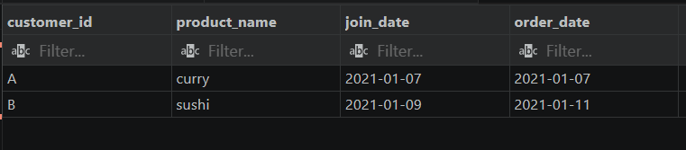

### Q7: Which item was purchased just before the customer became a member?

```SQL

WITH orders_after_membership AS (
    SELECT s.customer_id, m.join_date, n.product_name, s.order_date, s.product_id, n.price
    FROM dannys_dinner.sales s
    LEFT JOIN dannys_dinner.members m ON m.customer_id = s.customer_id
    JOIN dannys_dinner.menu n ON n.product_id = s.product_id
),
order_after_membership_ranking AS (
    SELECT customer_id, product_name, join_date, order_date, price,
    DENSE_RANK() OVER(PARTITION BY customer_id ORDER BY order_date::DATE DESC) AS ranked
    FROM orders_after_membership
    WHERE join_date::DATE > order_date::DATE
)
SELECT customer_id, product_name, join_date, order_date,
(join_date::DATE - order_date::DATE) AS Days_difference
FROM order_after_membership_ranking
WHERE ranked = 1;
```
Query results Question 7:

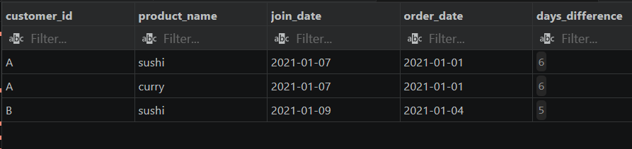

### Q8: What is the total items and amount spent for each member before they became a member?

```SQL
WITH all_orders_and_prices AS (
    SELECT s.customer_id, m.join_date, n.product_name, s.order_date, s.product_id, n.price
    FROM dannys_dinner.sales s
    LEFT JOIN dannys_dinner.members m ON m.customer_id = s.customer_id
    JOIN dannys_dinner.menu n ON n.product_id = s.product_id
)
SELECT customer_id, 
COUNT(product_name) AS total_orders, 
SUM(price) AS total_Price
FROM all_orders_and_prices
WHERE join_date > order_date OR join_date IS NULL 
GROUP BY customer_id
ORDER BY total_orders, total_Price ASC;
```

Query results Question 8:

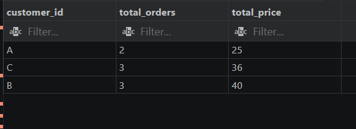

### Q9: If each $1 spent equates to 10 points and sushi has a 2x points multiplier - how many points would each customer have?

```SQL
WITH all_orders_and_prices AS (
    SELECT s.customer_id, m.join_date, n.product_name, s.order_date, s.product_id, n.price,
    (CASE WHEN n.product_name != 'sushi' THEN n.price * 10 
          ELSE n.price * 10 * 2 
     END) AS points
    FROM dannys_dinner.sales s
    LEFT JOIN dannys_dinner.members m ON m.customer_id = s.customer_id
    JOIN dannys_dinner.menu n ON n.product_id = s.product_id
)
SELECT customer_id, SUM(points) AS total_points
FROM all_orders_and_prices
GROUP BY customer_id
ORDER BY total_points ASC;
```
Query results Question 9:

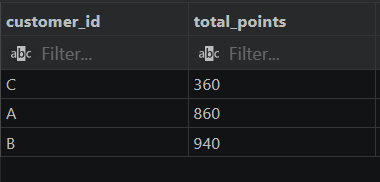


### Q10: In the first week after a customer joins the program (including their join date) they earn 2x points on all items, not just sushi - how many points do customer A and B have at the end of January?

```SQL
WITH points_category_table AS (
    SELECT s.customer_id, m.join_date, n.product_name, s.order_date, s.product_id, n.price,
    (CASE WHEN m.join_date <= s.order_date AND s.order_date - m.join_date <= 6 THEN 'valid'
          ELSE 'invalid'
     END) AS week_one_points
    FROM dannys_dinner.sales s
    LEFT JOIN dannys_dinner.members m ON m.customer_id = s.customer_id
    JOIN dannys_dinner.menu n ON n.product_id = s.product_id
),
total_points_table AS (
    SELECT customer_id,
    (CASE WHEN product_name != 'sushi' AND week_one_points = 'invalid' THEN price * 10 
          WHEN product_name != 'sushi' AND week_one_points = 'valid' THEN price * 10 * 2
          WHEN product_name = 'sushi' THEN price * 10 * 2
     END) AS points
    FROM points_category_table
    WHERE customer_id != 'C'
)
SELECT customer_id, SUM(points) AS sum
FROM total_points_table
GROUP BY customer_id;
```
Query results Question 10:

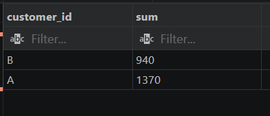


### 🌟 Bonus Challenges
### Bonus 1: Join All The Things (View Creation)/nRecreates the baseline summary schema mapping out whether orders were placed before or after joining the membership program.

```SQL
CREATE OR REPLACE VIEW dannys_dinner.all_data AS (
    SELECT s.customer_id, m.join_date, n.product_name, s.order_date, n.price,
    (CASE WHEN m.join_date <= s.order_date THEN 'Y'
          ELSE 'N'
     END) AS member
    FROM dannys_dinner.sales s
    LEFT JOIN dannys_dinner.members m ON m.customer_id = s.customer_id
    JOIN dannys_dinner.menu n ON n.product_id = s.product_id
);

-- View output data
SELECT * FROM dannys_dinner.all_data
ORDER BY customer_id, order_date;
```
View Output Dataset:

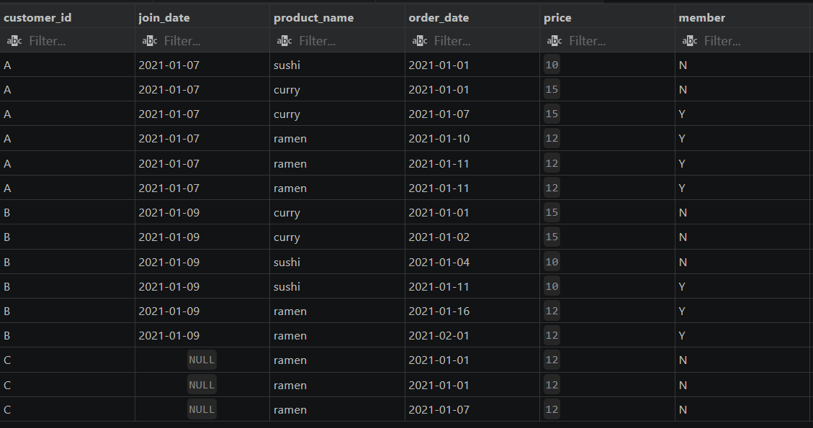

### Bonus 2: Rank All The Things (View Creation)
### Generates sequential rankings specifically for member purchases while keeping non-member records labeled as NULL.


```SQL
CREATE OR REPLACE VIEW dannys_dinner.ranked_data AS (
    WITH main AS (
        SELECT s.customer_id, m.join_date, n.product_name, s.order_date, n.price,
        (CASE WHEN m.join_date <= s.order_date THEN 'Y'
              ELSE 'N'
         END) AS member
        FROM dannys_dinner.sales s
        LEFT JOIN dannys_dinner.members m ON m.customer_id = s.customer_id
        JOIN dannys_dinner.menu n ON n.product_id = s.product_id
    )
    SELECT *, 
    (CASE WHEN member = 'Y' THEN DENSE_RANK() OVER(PARTITION BY customer_id, member ORDER BY order_date)
          ELSE NULL
     END) AS ranking
    FROM main
);

-- View output data
SELECT * FROM dannys_dinner.ranked_data;
```

View Output Dataset:

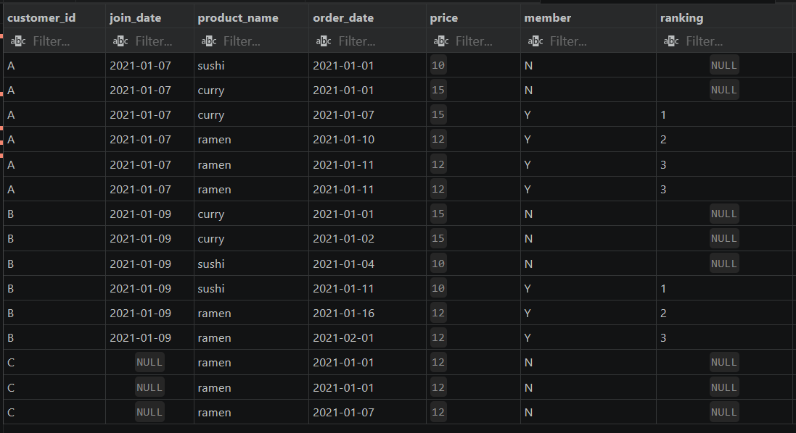

## Key Skills Demonstrated

**Advanced Aggregations:** Utilizing specialized group structures (SUM, COUNT, DISTINCT).

**Window Functions:** Multi-layered applications of ROW_NUMBER(), RANK(), and DENSE_RANK().

**CTEs (Common Table Expressions):** Writing neat, multi-stage recursive subqueries for optimal code readability.

**Conditional Logic:** Complex row transformations through conditional mapping statements (CASE WHEN).