# 🍕 Case Study #2: Pizza Runner - Pizza Metrics Solutions

This repository contains my SQL solutions for the **Section A: Pizza Metrics** questions from the [Pizza Runner Case Study #2](https://8weeksqlchallenge.com/case-study-2/).


The primary objective of this section is to extract operational insights regarding total pizza order volume, active customer trends, runner delivery success rates, and basic customer behavior patterns using aggregation and string formatting functions.

---

## 🛠️ Tech Stack & Methods
* **Database Engine:** PostgreSQL
* **SQL Techniques Used:** Common Table Expressions (CTEs), Aggregation (`COUNT`, `DISTINCT`), Table Joins (`INNER JOIN`), String/Date Transformation (`TO_CHAR` / Date formatting formatting syntax), Conditional Logic (`CASE WHEN`).
* **Python 3.13.3:** pandas for datacleaning
---

## 📊 Solutions and Insights

### Q1. How many pizzas were ordered?
```sql
SELECT COUNT(pizza_id) AS number_of_pizzas_ordered
FROM pizza_runner.customer_orders;
```
**Results:** number_of_pizzas_ordered 14

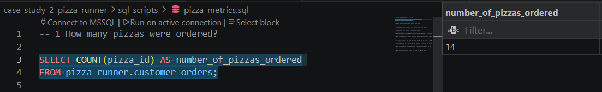

### Q2. How many unique customer orders were made?

```sql
SELECT COUNT(DISTINCT(customer_id)) AS unique_customer_orders
FROM pizza_runner.customer_orders;
```
**Results:** unique_customer_orders 5

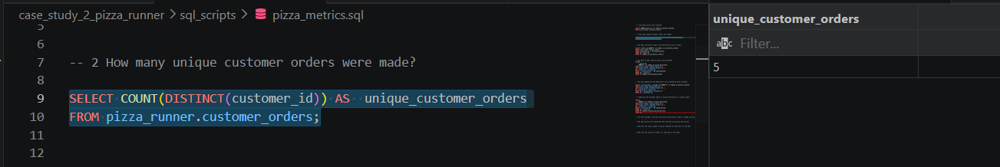

### Q3. How many successful orders were delivered by each runner?

```SQL
SELECT runner_id, COUNT(*) AS number_of_successful_orders
FROM pizza_runner.runner_orders
WHERE cancellation = 'No Cancellation'
GROUP BY runner_id
ORDER BY number_of_successful_orders;
```
**Results:**

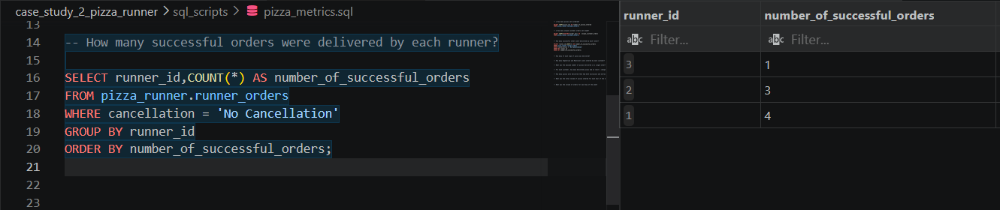

### Q4. How many of each type of pizza was delivered?

```SQL
SELECT 
    c.pizza_id,
    COUNT(*) AS number_of_pizza_delivered
FROM pizza_runner.runner_orders AS r
JOIN pizza_runner.customer_orders AS c
  ON r.order_id = c.order_id
WHERE r.cancellation = 'No Cancellation'
GROUP BY c.pizza_id
ORDER BY number_of_pizza_delivered;
```
**Results:**

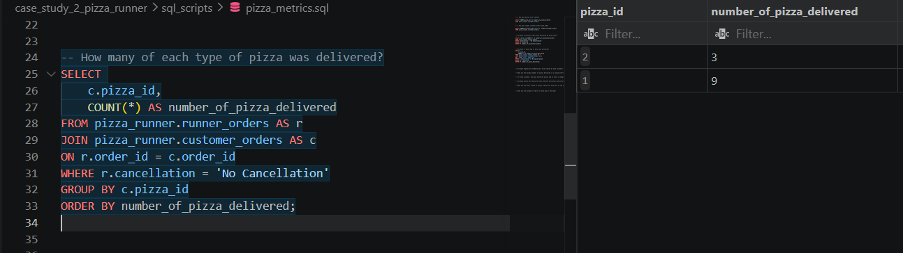

### Q5. How many Vegetarian and Meatlovers were ordered by each customer?

```SQL
SELECT n.pizza_name, c.customer_id, COUNT(*) AS number_of_pizzas_ordered
FROM pizza_runner.pizza_names AS n
JOIN pizza_runner.customer_orders AS c
  ON c.pizza_id = n.pizza_id
GROUP BY n.pizza_name, c.customer_id
ORDER BY c.customer_id;
```
**Results:**

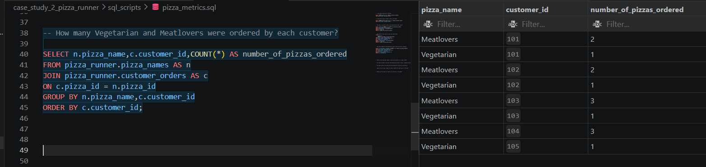

### Q6. What was the maximum number of pizzas delivered in a single order?

```SQL
SELECT 
    COUNT(*) AS number_of_pizza_delivered
FROM pizza_runner.runner_orders AS r
JOIN pizza_runner.customer_orders AS c
  ON r.order_id = c.order_id
WHERE r.cancellation = 'No Cancellation'
GROUP BY c.order_id
ORDER BY number_of_pizza_delivered DESC
LIMIT 1;
```
**Results:**

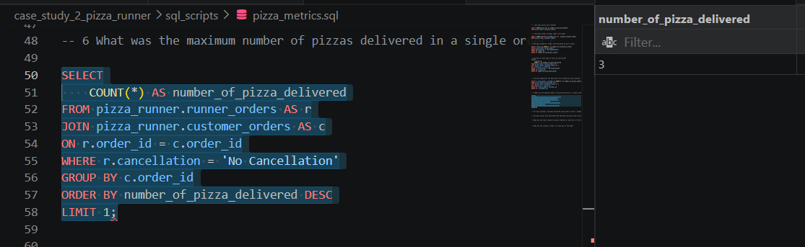

### Q7. For each customer, how many delivered pizzas had at least 1 change and how many had no changes?

```SQL
WITH delivered AS (
    SELECT 
        r.order_id,
        r.cancellation,
        c.customer_id,
        c.pizza_id,
        c.exclusions,
        c.extras
    FROM pizza_runner.runner_orders AS r
    JOIN pizza_runner.customer_orders AS c
      ON r.order_id = c.order_id
    WHERE r.cancellation = 'No Cancellation'
),
casedelivered AS (
    SELECT order_id, customer_id, pizza_id, exclusions, extras,
    (CASE WHEN exclusions = 'None' AND extras = 'None' THEN 'no_change'
          ELSE 'changed'
     END) AS pizza_change
    FROM delivered
)
SELECT customer_id, pizza_change, COUNT(*) AS change_count
FROM casedelivered
GROUP BY customer_id, pizza_change
ORDER BY pizza_change;
```
**Results:**

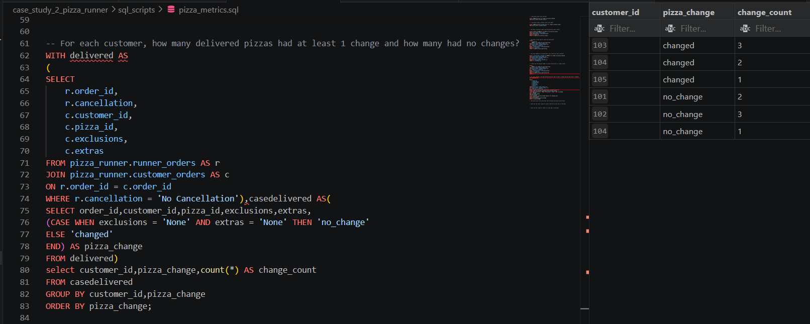

### Q8. How many pizzas were delivered that had both exclusions and extras?

```SQL
WITH delivered AS
(
SELECT
    r.order_id,
    r.cancellation,
    c.customer_id,
    c.pizza_id,
    c.exclusions,
    c.extras
FROM pizza_runner.runner_orders AS r
JOIN pizza_runner.customer_orders AS c
ON r.order_id = c.order_id
WHERE r.cancellation = 'No Cancellation'),casedelivered AS(
SELECT order_id,customer_id,pizza_id,exclusions,extras,
(CASE WHEN exclusions = 'None' AND extras = 'None' THEN 'no_change'
    WHEN exclusions != 'None' AND extras != 'None' THEN 'both_changed'
ELSE 'changed'
END) AS pizza_change
FROM delivered)
select pizza_change,COUNT(*) AS change_count
FROM casedelivered
WHERE pizza_change = 'both_changed'
GROUP BY pizza_change;
```


**Results:**

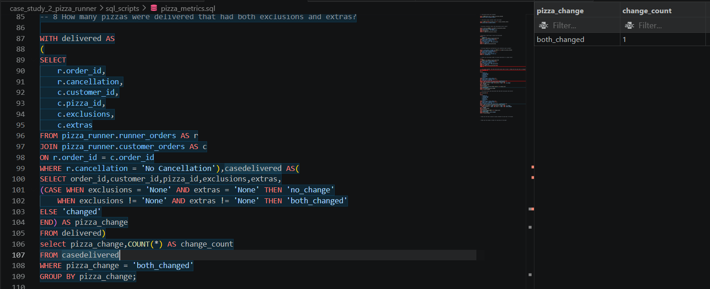

### Q9.What was the total volume of pizzas ordered for each hour of the day?

```SQL
WITH hour_data AS
(SELECT *,
    EXTRACT(HOUR FROM order_time) AS hour_ordered 
FROM pizza_runner.customer_orders)
SELECT hour_ordered,COUNT(*) AS total_pizzas
FROM hour_data
GROUP BY hour_ordered
ORDER BY total_pizzas DESC;
```

**Results:**

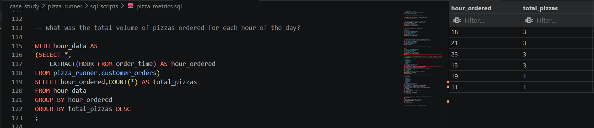

### Q10. What was the volume of orders for each day of the week?

```SQL
WITH day_data AS
(SELECT *,
    TO_CHAR(order_time,'FMDay') AS day_ordered 
FROM pizza_runner.customer_orders)
SELECT day_ordered,COUNT(*) AS total_pizzas
FROM day_data
GROUP BY day_ordered
ORDER BY total_pizzas DESC;
```

**Results:**

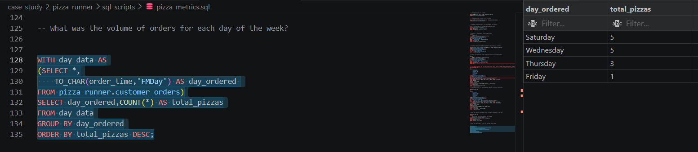

## 📈 Key Findings from Pizza Metrics
* **Product Dominance:** Meatlovers (pizza_id: 1) is drastically more popular than Vegetarian, making up 75% of all successful deliveries (9 out of 12 delivered pizzas).

* **Peak Operations:** Saturday and Wednesday see the highest incoming traffic volume (5 orders each), while Friday has the lowest operational footprint.


## Pizza Runner Challenge - Runner and Customer Experience Analytics

## 📊 Solutions and Insights

### Q1: How many runners signed up for each 1-week period? (i.e. week starts 2021-01-01)

```SQL
SELECT 
    registration_week_number,
    COUNT(runner_id) AS count_runners_registered
FROM (
    SELECT 
        runner_id,
        registration_date,
        CONCAT('Week ', EXTRACT(WEEK FROM registration_date)) AS registration_week_number
    FROM pizza_runner.runners
) AS base_query
GROUP BY registration_week_number
ORDER BY registration_week_number;
```

**Results:**

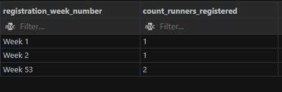

### Q2: What was the average time in minutes it took for each runner to arrive at the Pizza Runner HQ to pickup the order?

```SQL
WITH time_calculator AS (
    SELECT 
        r.runner_id,
        ROUND((EXTRACT(EPOCH FROM (r.pickup_time::TIMESTAMP - c.order_time::TIMESTAMP)) / 60), 2) AS time_diff
    FROM pizza_runner.runner_orders AS r
    JOIN pizza_runner.customer_orders AS c ON c.order_id = r.order_id
)
SELECT 
    runner_id, 
    ROUND(AVG(time_diff), 0) AS average_in_minutes
FROM time_calculator
GROUP BY runner_id
ORDER BY runner_id;
```

**Results:**

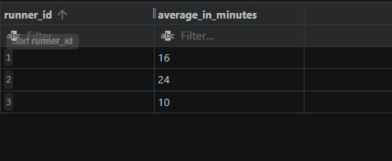

### Q3: Is there any relationship between the number of pizzas and how long the order takes to prepare?

```SQL
WITH pizza_prep AS (
    SELECT 
        c.pizza_id,
        ROUND((EXTRACT(EPOCH FROM (r.pickup_time::TIMESTAMP - c.order_time::TIMESTAMP)) / 60), 2) AS prep_time
    FROM pizza_runner.runner_orders AS r
    JOIN pizza_runner.customer_orders AS c ON c.order_id = r.order_id
)
SELECT 
    pizza_id,
    COUNT(pizza_id) AS total_number_of_pizzas_ordered,
    ROUND(AVG(prep_time), 0) AS average_prep_time_in_min_from_order_date_to_pick_up_time
FROM pizza_prep
GROUP BY pizza_id;
```
**Results:**

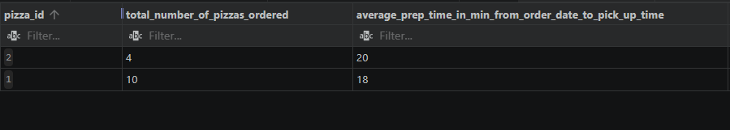


### Q4: What was the average distance travelled for each customer?

```SQL
SELECT 
    c.customer_id,
    CONCAT(ROUND(AVG(r.distance::NUMERIC), 2), ' km') AS avg_distance
FROM pizza_runner.runner_orders AS r
JOIN pizza_runner.customer_orders AS c ON c.order_id = r.order_id
GROUP BY c.customer_id
ORDER BY c.customer_id;
```
**Results:**

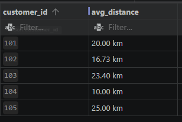

### Q5: What was the difference between the longest and shortest delivery times for all orders?
```SQL
SELECT 
    CONCAT((MAX(duration::NUMERIC) - MIN(duration::NUMERIC)), ' MINUTES') AS diff_longest_shortest_delivery_time
FROM pizza_runner.runner_orders;
```

**Results:**


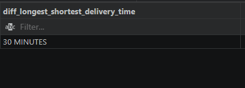

### Q6: What was the average speed for each runner for each delivery and do you notice any trend for these values?

```SQL
-- Formula applied: Speed = (Distance in meters) / (Duration in seconds)
SELECT 
    order_id,
    runner_id,
    CONCAT(ROUND(AVG((distance::NUMERIC * 1000) / (duration::NUMERIC * 60)), 2), ' M/S') AS "speed_in_M/S"
FROM pizza_runner.runner_orders
WHERE distance IS NOT NULL OR duration IS NOT NULL
GROUP BY order_id, runner_id
ORDER BY order_id;
```
**Results:**

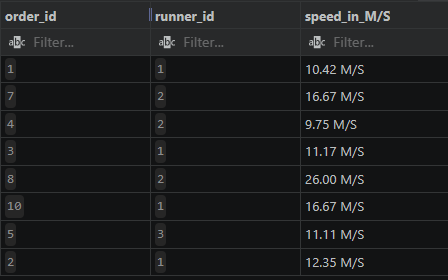

#### Observations & Trends

* **Runner 2 Variance:** Runner 2 shows extreme speed variations, starting at a modest `9.75 M/S (Order 4)` and hitting an extraordinarily high speed of `26.00 M/S (Order 8)`.

* **Runner 1 Consistency:** Runner 1 maintains a highly predictable pacing across their initial batches, averaging around `10 - 12 M/S` before shifting gears up to `16.67 M/S` for Order 10.

### Q7: What is the successful delivery percentage for each runner?

```SQL
SELECT 
    runner_id,
    CONCAT(
        ROUND(
            (COUNT(*) FILTER (WHERE status_b = 'No Cancellation')::NUMERIC / COUNT(*)::NUMERIC) * 100, 
            0
        ), 
        '%'
    ) AS successful_delivery_percent
FROM (
    SELECT 
        runner_id,
        cancellation,
        order_id,
        CASE 
            WHEN cancellation IS NULL OR cancellation IN ('', 'null') THEN 'No Cancellation'
            ELSE 'Cancellation'
        END AS status_b
    FROM pizza_runner.runner_orders
) AS sub_query
GROUP BY runner_id
ORDER BY runner_id;
```

**Results:**

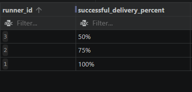


## 🍕Pizza Runner:Ingredient Optimisation & Pricing and Ratings

This document serves as a comprehensive production portfolio containing PostgreSQL solutions for **Part C (Ingredient Optimization)** and **Part D (Pricing & Ratings)** of the **Pizza Runner** case study (from Danny Ma's 8 Week SQL Challenge).

The queries address complex structural data challenges, data normalization, regex-based string extraction, window analytics, and dynamic financial ledger balances.

---


## 💻 Case Study Solutions

### 1. What are the standard ingredients for each pizza?

**Objective:** Flatten the comma-separated recipes and group them cleanly by pizza flavor.

```sql
WITH cte AS (
    SELECT 
        i.pizza_id,
        n.pizza_name,
        t.topping_id,
        t.topping_name
    FROM pizza_runner.pizza_toppings t
    JOIN (
        SELECT 
            pizza_id,
            TRIM(string_to_table(toppings, ',')) AS topping_id
        FROM pizza_runner.pizza_recipes
    ) AS i ON t.topping_id = i.topping_id::NUMERIC
    JOIN pizza_runner.pizza_names n ON n.pizza_id = i.pizza_id
)
SELECT 
    pizza_name,
    STRING_AGG(topping_name, ', ') AS toppings_name
FROM cte
GROUP BY pizza_name;
```

**Results:**

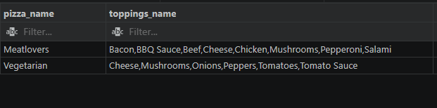


### 2. What was the most commonly added extra?

```SQL
SELECT 
    topping_name,
    COUNT(*) AS times_add_extra_requests
FROM (
    SELECT 
        *,
        TRIM(string_to_table(co.extras, ',')) AS toppings_extra 
    FROM pizza_runner.customer_orders AS co
) AS c
JOIN pizza_runner.pizza_toppings t ON t.topping_id = c.toppings_extra::INT
WHERE toppings_extra::VARCHAR != 'None' AND toppings_extra IS NOT NULL
GROUP BY topping_name
ORDER BY times_add_extra_requests DESC
LIMIT 1;
```

**Results:**

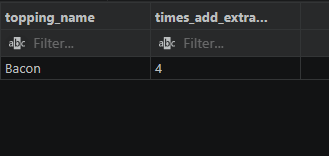

### 3. What was the most common exclusion?

```SQL
SELECT 
    topping_name,
    COUNT(*) AS times_add_exclusions_requests
FROM (
    SELECT 
        *,
        TRIM(string_to_table(co.exclusions, ',')) AS toppings_exclusions 
    FROM pizza_runner.customer_orders AS co
) AS c
JOIN pizza_runner.pizza_toppings t ON t.topping_id = c.toppings_exclusions::INT
WHERE toppings_exclusions::VARCHAR != 'None' AND toppings_exclusions IS NOT NULL
GROUP BY topping_name
ORDER BY times_add_exclusions_requests DESC
LIMIT 1;
```

**Results:**

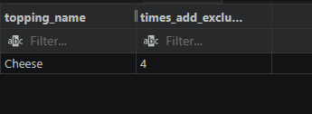

### 4. Generate an order item for each record in the customers_orders table in the format of one of the following:
- Meat Lovers
- Meat Lovers - Exclude Beef
- Meat Lovers - Extra Bacon
- Meat Lovers - Exclude Cheese, Bacon - Extra Mushroom, Peppers

```SQL
WITH cte AS (
    SELECT 
        *,
        CASE 
            WHEN pizza_id = 1 AND toppings_extra = 'None' AND toppings_exclusions = 'None' THEN 'Meat Lovers'
            WHEN pizza_id = 1 AND toppings_extra = 'None' AND toppings_exclusions = '3' THEN 'Meat Lovers - Exclude Beef'
            WHEN pizza_id = 1 AND toppings_extra = '1' AND toppings_exclusions = 'None' THEN 'Meat Lovers - Extra Bacon'
            WHEN pizza_id = 1 AND (toppings_extra::VARCHAR IN ('4','2','6') AND toppings_exclusions::VARCHAR IN ('5','1','6')) THEN 
                'Meat Lovers - Exclude Cheese, BBQ, Mushrooms - Extra Chicken, Bacon, Mushrooms'
            WHEN pizza_id = 1 AND (toppings_extra IN ('9','6') OR toppings_exclusions IN ('4')) THEN 'Meat Lovers - Exclude Cheese, Bacon - Extra Mushroom, Peppers'
            WHEN pizza_id = 2 THEN 'Vegetarian'
        END AS category
    FROM (
        SELECT 
            *,
            TRIM(string_to_table(co.exclusions, ',')) AS toppings_exclusions,
            TRIM(string_to_table(co.extras, ',')) AS toppings_extra
        FROM pizza_runner.customer_orders AS co
    ) AS unnested_orders
)
SELECT 
    pizza_id,
    exclusions,
    extras,
    category
FROM cte
WHERE category IS NOT NULL;
```

**Results:**

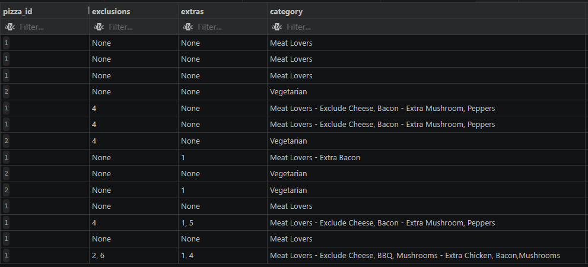


### 5. Generate an alphabetically ordered comma separated ingredient list for each pizza order from the customer_orders table and add a 2x in front of any relevant ingredients

```SQL
WITH cte AS (
    SELECT 
        i.pizza_id,
        n.pizza_name,
        t.topping_id,
        t.topping_name,
        c.order_id
    FROM pizza_runner.pizza_toppings t
    JOIN (
        SELECT 
            pizza_id,
            TRIM(string_to_table(toppings, ',')) AS topping_id
        FROM pizza_runner.pizza_recipes
    ) AS i ON t.topping_id = i.topping_id::NUMERIC
    JOIN pizza_runner.pizza_names n ON n.pizza_id = i.pizza_id
    JOIN pizza_runner.customer_orders AS c ON c.pizza_id = i.pizza_id
),
nestcte AS (
    SELECT 
        order_id,
        topping_name,
        COUNT(topping_name) OVER(PARTITION BY order_id, topping_name) AS ingcount
    FROM cte
),
nestedcte2 AS (
    SELECT 
        order_id,
        topping_name,
        CASE
            WHEN ingcount > 1 THEN ingcount || 'x ' || topping_name
            ELSE topping_name
        END AS ingredient
    FROM nestcte
)
SELECT 
    order_id,
    STRING_AGG(DISTINCT ingredient, ', ' ORDER BY ingredient ASC) AS ingredient_list_for_each_pizza_order
FROM nestedcte2
GROUP BY order_id;
```

**Results:**

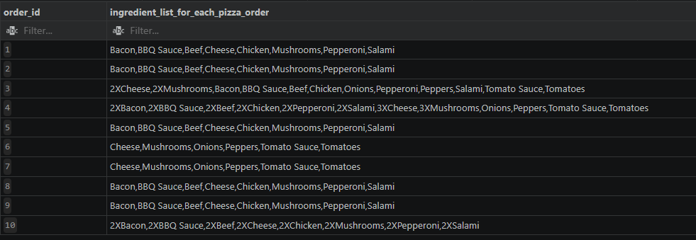


### 6. What is the total quantity of each ingredient used in all delivered pizzas sorted by most frequent first?

```SQL
WITH cte AS (
    SELECT 
        i.pizza_id,
        n.pizza_name,
        t.topping_id,
        t.topping_name,
        c.order_id,
        r.cancellation
    FROM pizza_runner.pizza_toppings t
    JOIN (
        SELECT 
            pizza_id,
            TRIM(string_to_table(toppings, ',')) AS topping_id
        FROM pizza_runner.pizza_recipes
    ) AS i ON t.topping_id = i.topping_id::NUMERIC
    JOIN pizza_runner.pizza_names n ON n.pizza_id = i.pizza_id
    JOIN pizza_runner.customer_orders AS c ON c.pizza_id = i.pizza_id
    JOIN pizza_runner.runner_orders AS r ON c.order_id = r.order_id
),cte2 AS
(SELECT 
    topping_name,
    COUNT(topping_name) FILTER(WHERE cancellation = 'No Cancellation') AS number_ingredient_used
FROM cte
GROUP BY topping_name)
SELECT
    topping_name,
    number_ingredient_used
FROM cte2
ORDER BY number_ingredient_used DESC;
```

**Results:**

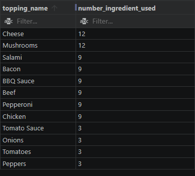

---
## D. Pricing and Ratings

### 1. If a Meat Lovers pizza costs $12 and Vegetarian costs $10 and there were no charges for changes - how much money has Pizza Runner made so far if there are no delivery fees?

```SQL
WITH cte AS (
    SELECT 
        r.order_id,
        c.pizza_id,
        c.customer_id,
        r.cancellation,
        (CASE 
            WHEN c.pizza_id = 1 THEN 12
            WHEN c.pizza_id = 2 THEN 10
         END) AS price
    FROM pizza_runner.customer_orders AS c
    JOIN pizza_runner.runner_orders AS r ON r.order_id = c.order_id
)
SELECT
    SUM(price) FILTER(WHERE cancellation = 'No Cancellation') AS "total cost for both pizza_type"
FROM cte;
```

**Results:**

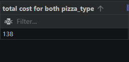


### 2. What if there was an additional $1 charge for any pizza extras?

```SQL
WITH cte AS (
    SELECT 
        r.order_id,
        c.pizza_id,
        c.customer_id,
        r.cancellation,
        c.extras,
        ARRAY_LENGTH(ARRAY_REMOVE(STRING_TO_ARRAY(REGEXP_REPLACE(c.extras::TEXT, '\s+', '', 'g'), ','), 'None'), 1) AS extraa,
        (CASE WHEN c.pizza_id = 1 THEN 12 WHEN c.pizza_id = 2 THEN 10 END) AS price
    FROM pizza_runner.customer_orders AS c
    JOIN pizza_runner.runner_orders AS r ON r.order_id = c.order_id
)
SELECT 
    SUM(extraa) FILTER(WHERE cancellation = 'No Cancellation') + 
    SUM(price) FILTER(WHERE cancellation = 'No Cancellation') AS "total cost with additional $1 charge"
FROM cte;
```


**Results:**

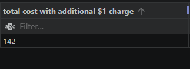

### 3. The Pizza Runner team now wants to add an additional ratings system that allows customers to rate their runner, how would you design an additional table for this new dataset - generate a schema for this new table and insert your own data for ratings for each successful customer order between 1 to 5.

```SQL
CREATE TABLE pizza_runner.runner_ratings (
    order_id INT,
    customer_id INT,
    pizza_id INT,
    runner_id INT,
    rating INT CHECK(rating BETWEEN 1 AND 5)
);

INSERT INTO pizza_runner.runner_ratings 
    (order_id, customer_id, pizza_id, runner_id, rating)
VALUES
    (1, 101, 1, 1, 3),
    (2, 101, 1, 1, 3),
    (3, 102, 1, 1, 4),
    (3, 102, 2, 1, 4),
    (4, 103, 1, 2, 3),
    (4, 103, 2, 2, 2),
    (5, 104, 1, 3, 4),
    (7, 105, 2, 2, 3),
    (8, 102, 1, 2, 4),
    (10, 104, 1, 1, 5);

SELECT * FROM pizza_runner.runner_ratings;
```

### 4. Using your newly generated table - can you join all of the information together to form a table which has the following information for successful deliveries?
- `customer_id`
- `order_id`
- `runner_id`
- `rating`
- `order_time`
- `pickup_time`
- `Time between order and pickup`
- `Delivery duration`
- `Average speed`
- `Total number of pizzas`

```SQL
SELECT 
    co.customer_id,
    co.order_id,
    ro.runner_id,
    rr.rating,
    co.order_time,
    ro.pickup_time::TIMESTAMP AS pickup_time,
    
    -- 1. Calculate preparation wait lag (time difference between order and pickup)
    EXTRACT('MINUTES' FROM (ro.pickup_time::TIMESTAMP - co.order_time)) AS time_between_order_and_pickup,
    
    -- 2. Clean and display delivery duration
    TRIM(REGEXP_REPLACE(ro.duration, '[a-zA-Z]+', '', 'g'))::NUMERIC AS delivery_duration_minutes,
    
    -- 3. Calculate average running velocity (Distance in km / Hours)
    ROUND(
        (TRIM(REGEXP_REPLACE(ro.distance, '[a-zA-Z]+', '', 'g'))::NUMERIC) / 
        ((TRIM(REGEXP_REPLACE(ro.duration, '[a-zA-Z]+', '', 'g'))::NUMERIC) / 60.0), 
        2
    ) AS average_speed_km_h,
    
    -- 4. Aggregate sum volume of individual product identifiers 
    COUNT(co.pizza_id) AS total_number_of_pizzas

FROM pizza_runner.customer_orders co
JOIN pizza_runner.runner_orders ro ON co.order_id = ro.order_id
LEFT JOIN pizza_runner.runner_ratings rr ON co.order_id = rr.order_id AND co.pizza_id = rr.pizza_id
WHERE ro.cancellation = 'No Cancellation'
GROUP BY 
    co.customer_id,
    co.order_id,
    ro.runner_id,
    rr.rating,
    co.order_time,
    ro.pickup_time,
    ro.duration,
    ro.distance
ORDER BY co.order_id;
```


**Results:**

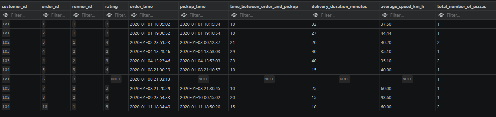

### 5. If a Meat Lovers pizza was $12 and Vegetarian $10 fixed prices with no cost for extras and each runner is paid $0.30 per kilometre traveled - how much money does Pizza Runner have left over after these deliveries?

```SQL
WITH cte AS (
    SELECT 
        co.customer_id,
        co.order_id,
        ro.runner_id,
        rr.rating,
        co.order_time,
        co.pizza_id,
        ro.pickup_time::TIMESTAMP AS pickup_time,
        TRIM(REGEXP_REPLACE(ro.distance, '[a-zA-Z]+', '', 'g'))::NUMERIC AS delivery_duration_km,
        (CASE 
            WHEN co.pizza_id = 1 THEN 12
            ELSE 10
         END) AS price
    FROM pizza_runner.customer_orders co
    JOIN pizza_runner.runner_orders ro ON co.order_id = ro.order_id
    LEFT JOIN pizza_runner.runner_ratings rr ON co.order_id = rr.order_id AND co.pizza_id = rr.pizza_id
    WHERE ro.cancellation = 'No Cancellation'
)
SELECT 
    SUM(price) - SUM((delivery_duration_km * 0.3)) AS total_after_delivery_fee
FROM cte;
```


**Results:**

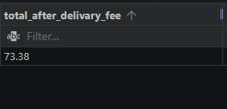

## E. Bonus Questions
### If Danny wants to expand his range of pizzas - how would this impact the existing data design? Write an `INSERT` statement to demonstrate what would happen if a new `Supreme` pizza with all the toppings was added to the Pizza Runner menu?

```SQL
-- Injecting item #3: 'Supreme' into names schema
INSERT INTO pizza_runner.pizza_names ("pizza_id", "pizza_name")
VALUES (3, 'Supreme');

-- Registering master ingredients footprint array listing for item #3
INSERT INTO pizza_runner.pizza_recipes ("pizza_id", "toppings")
VALUES (3, '1, 2, 3, 4, 5, 6, 7, 8, 9, 10, 11, 12');

-- Validation check to verify downstream integrity of new entries
SELECT *
FROM pizza_runner.pizza_names AS n
JOIN pizza_runner.pizza_recipes AS r ON n.pizza_id = r.pizza_id;
```

**Results:**

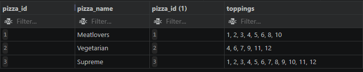


## 🧠 Key SQL Concepts
1. **String Normalization:** Leveraging `PostgreSQL's` native `string_to_table()` function to explode structural array strings into standard transactional lookup tables.

2. **Conditional Aggregations:** Implementing the modern `FILTER (WHERE ...)` syntax alongside conventional grouping metrics to clean data calculations seamlessly inline.

3. **Window Analytics:** Applying mathematical execution scopes over custom dimensions using the syntax: `COUNT(...) OVER (PARTITION BY ...)` to dynamically flag multi-count ingredients before output aggregation.

4. **Complex String Manipulation:** Combining conditional mutations `(CASE WHEN)` alongside ordered text arrays `(STRING_AGG(DISTINCT ... ORDER BY ...)`).